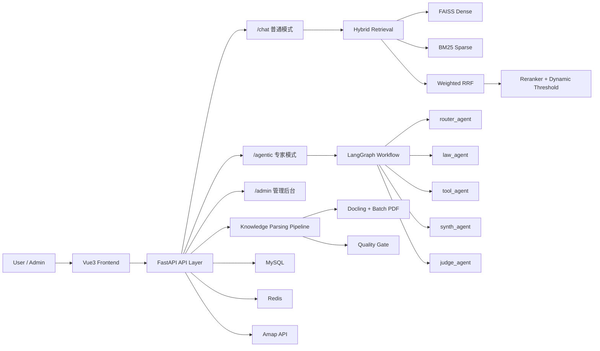

# Traffic QA System

[](https://www.python.org/)
[](https://fastapi.tiangolo.com/)
[](https://vuejs.org/)
[](https://www.mysql.com/)
[](https://redis.io/)
[](https://www.langchain.com/langgraph)
[](./LICENSE)

交通法规智能问答与出行辅助系统。  
本项目采用 `Hybrid RAG + Agentic RAG` 双模式架构，覆盖法规问答、地图/天气工具调用、知识库解析、后台运营与审计。

## 目录

- [项目定位](#项目定位)
- [核心能力](#核心能力)
- [系统架构](#系统架构)
- [关键流程说明](#关键流程说明)
- [知识库解析流程](#知识库解析流程)
- [管理后台能力](#管理后台能力)
- [技术栈](#技术栈)
- [项目结构](#项目结构)
- [快速开始](#快速开始)
- [接口清单](#接口清单)
- [Skill 可插拔扩展](#skill-可插拔扩展)
- [联调建议](#联调建议)
- [常见问题](#常见问题)
- [开发与质量](#开发与质量)

## 项目定位

该项目不是单一聊天机器人，而是一套可运行的全栈系统：

- 用户侧：普通问答、专家问答、历史会话、个人 AI 偏好、反馈
- 管理侧：检索指标、系统健康、知识库解析状态、模型配置、审计与通知
- AI 侧：并行混合检索、多 Agent 状态机、长期记忆与 checkpoint 恢复

## 核心能力

### 1) 普通模式（极速问答）

- 并行召回：`FAISS + BM25`
- 融合策略：`Weighted RRF`
- 精排与过滤：`Rerank + 动态阈值 + 最小保留`
- 对话记忆：短期历史 + 摘要压缩，控制上下文增长

### 2) 专家模式（Agentic RAG）

- LangGraph 多节点流程：`router / law / tool / synth / judge`
- `law_agent` 与 `tool_agent` 并行执行后汇总
- `tool_agent` 先做强约束 JSON 参数规划，再调工具
- `judge_agent` 输出结构化风险：`low / medium / high`
- 关键节点落 checkpoint，可从最近节点恢复

### 3) 知识库解析与质量门控

- 支持：`pdf / docx / txt / md`
- PDF：Docling 分批解析，控制内存峰值避免 OOM
- 标准类 PDF（GB 国标等）走专项解析器，增强章节/表格/图注结构
- 低质量硬失败，拒绝入库，避免污染检索索引

### 4) 后台运营能力

- 检索看板：召回、阈值、时延、fallback、成功率
- 解析看板：状态、质量指标、失败原因、重试
- 系统探针：MySQL / Redis / LLM / 高德 / 向量索引
- 模型管理：配置、激活、灰度对比
- 审计与通知：管理员操作留痕与告警中心

## 系统架构



## 关键流程说明

### A. 普通模式检索流程

1. 读取历史对话和摘要，必要时改写 query。
2. 并行执行 FAISS 与 BM25。
3. 使用 Weighted RRF 融合候选。
4. 调用 reranker 重排。
5. 动态阈值过滤：`max(base_threshold, top_score - dynamic_margin)`。
6. 记录检索指标并流式返回答案。

默认参数（`backend/app/core/constants.py`）：

| 参数 | 值 |
|---|---|
| `FAST_FAISS_TOP_K` | 20 |
| `FAST_BM25_TOP_N` | 20 |
| `FAST_FUSION_TOP_N` | 30 |
| `FAST_RERANK_TOP_N` | 8 |
| `FAST_RRF_WEIGHT_FAISS` | 0.6 |
| `FAST_RRF_WEIGHT_BM25` | 0.4 |
| `DEFAULT_SCORE_THRESHOLD` | 0.15 |
| `FAST_DYNAMIC_MARGIN` | 0.18 |
| `FAST_MIN_KEEP` | 3 |

### B. 专家模式 Agentic 流程

默认工作流可在 `backend/app/core/agentic/workflow_manifest.json` 配置：

```text
bootstrap
  -> router
     -> law (并行)
     -> tool (并行)
  -> synth
  -> judge
  -> end
```

节点职责：

- `router_agent`：意图识别与能力分配
- `law_agent`：法规检索、证据整理
- `tool_agent`：路线/周边/天气能力调用
- `synth_agent`：融合证据与工具结果
- `judge_agent`：事实一致性检查与风险分级

## 知识库解析流程

### 1) 文件路由

| 类型 | 处理方式 |
|---|---|
| `txt` | UTF-8 优先，失败回退 GBK |
| `pdf` | Docling 分批解析（默认批大小 5 页） |
| 标准类 PDF | `StandardPdfParser` 专项增强 |
| `docx/md` | Docling 转 Markdown |

### 2) 结构化切片

- Markdown 标题分层切片（章/节/条/款）
- 递归字符切片（`chunk_size=1200`，`overlap=200`）
- 增强元信息（章节路径、条款标记）

### 3) 质量门控指标

- `quality_score`
- `empty_chunk_rate`
- `garbled_chunk_rate`
- `short_chunk_rate`
- `table_chunk_rate`

当质量过低时，解析直接失败并拒绝入库，避免把噪声文本写入向量库与 BM25 索引。

## 管理后台能力

### 检索与运行观测

- `GET /api/v1/admin/retrieval/metrics`
- `GET /api/v1/admin/retrieval/runs_recent`
- `GET /api/v1/admin/retrieval/runs/{run_id}`

### 知识库运维

- `GET /api/v1/admin/knowledge/docs_enhanced`
- `GET /api/v1/admin/knowledge/{doc_id}/chunks`
- `POST /api/v1/admin/knowledge/{doc_id}/retry_parse`
- `POST /api/v1/admin/knowledge/rebuild_bm25`

### 系统与模型管理

- `GET /api/v1/admin/system/status`
- `GET /api/v1/admin/configs`
- `POST /api/v1/admin/configs`
- `PATCH /api/v1/admin/configs/{config_id}/activate`
- `POST /api/v1/admin/configs/{config_id}/ping`
- `GET /api/v1/admin/model/rollout`
- `PATCH /api/v1/admin/model/rollout`
- `POST /api/v1/admin/model/rollout/ping_compare`

### 审计与通知

- `GET /api/v1/admin/audit/logs`
- `GET /api/v1/admin/notifications`
- `POST /api/v1/admin/notifications/read_all`

## 技术栈

### Backend

- Python 3.12 / FastAPI / SQLAlchemy
- LangChain / LangGraph
- FAISS / rank-bm25 / jieba
- Docling / pypdf
- MySQL / Redis
- 高德 API + OpenAI Compatible 接口 + 阿里云 Embedding/Rerank

### Frontend

- Vue3 + TypeScript + Vite
- Element Plus
- ECharts
- Markdown-it

## 项目结构

```text
traffic_qa_system/
├─ backend/
│  ├─ app/
│  │  ├─ api/endpoints/            # auth/chat/quiz/admin/agentic
│  │  ├─ services/
│  │  │  ├─ rag_service.py
│  │  │  ├─ hybrid_search.py
│  │  │  ├─ standard_pdf_parser.py
│  │  │  └─ agentic/
│  │  ├─ models/
│  │  ├─ core/
│  │  └─ skills/plugins/           # 插件化 skill manifest
│  ├─ data/uploads/
│  ├─ data/faiss_index/
│  ├─ .env.example
│  ├─ init_db.py
│  └─ requirements-*.txt
└─ frontend/
   ├─ src/
   ├─ package.json
   └─ vite.config.ts
```

## 快速开始

### 1) 环境要求

- Python `3.12`
- Node.js `18+`
- MySQL `8+`
- Redis `6+`

### 2) 后端启动

```bash
cd backend

# 可选：虚拟环境
python -m venv .venv
# Windows
.venv\Scripts\activate
# macOS / Linux
source .venv/bin/activate

# 安装依赖（开发）
pip install -r requirements-prod.txt -r requirements-dev.txt

# 配置环境变量：复制 .env.example 为 .env 并填写 MySQL/Redis/API Keys

# 初始化数据库表
python init_db.py

# 启动后端
python -m uvicorn main:app --reload
```

后端地址：`http://127.0.0.1:8000`

### 3) 前端启动

```bash
cd frontend
npm install
npm run dev
```

前端地址：`http://127.0.0.1:5173`

### 4) 初次联调建议

1. 注册账号并登录拿 token。  
2. 将目标账号在 `users` 表设置为 `admin`。  
3. 配置并激活 AI 配置。  
4. 上传知识库并等待解析完成。  
5. 联调普通模式和专家模式接口。  

## 接口清单

### 认证

- `POST /api/v1/auth/register`
- `POST /api/v1/auth/login`
- `GET /api/v1/auth/captcha`

### 聊天与用户

- `POST /api/v1/chat/ask_stream`
- `POST /api/v1/agentic/expert_stream`
- `GET /api/v1/chat/me`
- `PUT /api/v1/chat/update_me`
- `POST /api/v1/chat/change_password`
- `POST /api/v1/chat/feedback`
- `GET /api/v1/chat/sessions`
- `GET /api/v1/chat/history/{session_id}`
- `DELETE /api/v1/chat/session/{session_id}`
- `POST /api/v1/chat/upload_avatar`

### 知识库与分析

- `POST /api/v1/chat/upload`
- `GET /api/v1/chat/knowledge_list`
- `DELETE /api/v1/chat/knowledge/{doc_id}`
- `GET /api/v1/chat/analytics`
- `POST /api/v1/chat/perform_analysis`
- `GET /api/v1/chat/knowledge_graph`
- `POST /api/v1/chat/build_graph`

### 题库模块

- `GET /api/v1/quiz/daily`
- `POST /api/v1/quiz/submit`
- `GET /api/v1/quiz/my_stats`
- `POST /api/v1/quiz/admin_generate`

### 管理后台

- `GET /api/v1/admin/dashboard/stats`
- `GET /api/v1/admin/users`
- `GET /api/v1/admin/system/status`
- `GET /api/v1/admin/retrieval/metrics`
- `GET /api/v1/admin/retrieval/runs_recent`
- `GET /api/v1/admin/audit/logs`
- `GET /api/v1/admin/notifications`
- `POST /api/v1/admin/notifications/read_all`
- `GET /api/v1/admin/configs`
- `POST /api/v1/admin/configs`
- `PATCH /api/v1/admin/configs/{config_id}/activate`
- `POST /api/v1/admin/configs/{config_id}/ping`
- `GET /api/v1/admin/model/rollout`
- `PATCH /api/v1/admin/model/rollout`
- `POST /api/v1/admin/model/rollout/ping_compare`
- `GET /api/v1/admin/knowledge/docs_enhanced`
- `GET /api/v1/admin/knowledge/{doc_id}/chunks`
- `POST /api/v1/admin/knowledge/{doc_id}/retry_parse`

## Skill 可插拔扩展

项目已支持 manifest 驱动的工具注册中心。  
目录：`backend/app/skills/plugins/<plugin_name>/manifest.json`

已内置插件：

- `law`：法规检索工具
- `amap`：路线、周边、天气工具

新增 Skill 最小步骤：

1. 实现工具工厂函数（返回 LangChain Tool）。  
2. 新建插件目录并写 `manifest.json`。  
3. 声明 `factory / capabilities / tools / policy`。  
4. 重启后端，注册中心自动发现并加载。  

## 联调建议

### 普通模式

1. 上传文档并等待解析完成。  
2. 调 `POST /api/v1/chat/ask_stream`。  
3. 查看日志中的 `faiss/bm25/fusion/final/threshold/latency_ms`。  

### 专家模式

1. 调 `POST /api/v1/agentic/expert_stream`。  
2. 观察 `router/law/tool/synth/judge` 节点流转日志。  
3. 到后台查看 retrieval 与 run 明细。  

### 解析链路

1. 上传含表格/多章节 PDF。  
2. 查看 `docs_enhanced` 的 `parse_meta + quality_metrics`。  
3. 失败时执行 `retry_parse`。  

## 常见问题

### 1) Embedding 报 `batch size invalid`

阿里云 embedding 批量上限为 10。项目默认 `EMBEDDING_BATCH_SIZE=10`，不要改大。

### 2) 专家模式 checkpoint 写入失败

检查 `agent_run_checkpoints.state_json` 是否为 `LONGTEXT`。历史环境需要确认数据库列类型。

### 3) PDF 解析失败

先看：

- `parse_status`
- `parse_error`
- `parse_meta`
- `quality_metrics`

解析低质量硬失败是保护策略，用于避免脏数据进入知识库。

## 开发与质量

```bash
cd backend

# 测试
pytest

# 静态检查
ruff check .
mypy .
```
